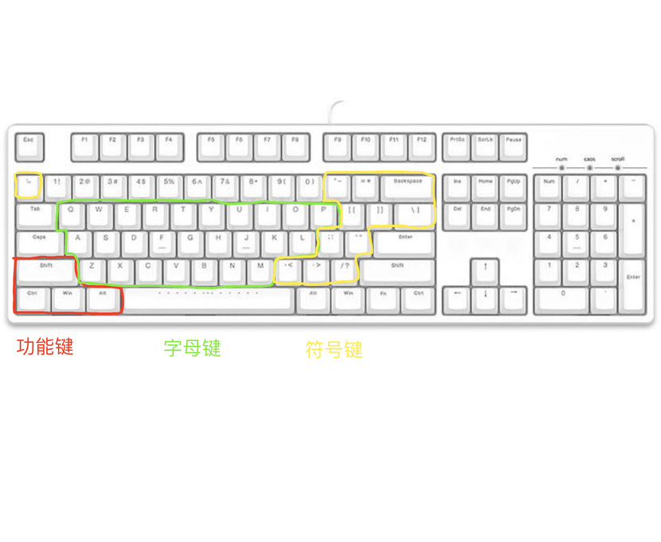

# 快捷键

该部分讲解作者的快捷键设计思路。

## 认识键盘

图中是一个经典的87键位的键盘。87键键盘是作者认为最适合程序员的键盘。

键盘中有三组被圈起来的键位，分别是功能键、字母键和符号键。

- 功能键

  功能键与负责文本输入的键位不同，你按键后，不会打印出任何字符，它们一般结合其他键位一起使用，从而在计算机上完成特定的功能。

  图中的功能键是4个，在计算机发展的历史长河中，除了图中的4个之外，还有很多其他的功能键，如现在emacs还保留着`Hyper`、`Meta`等功能键前缀。另外，不同厂商开发的计算机也会有一些自己特有的功能键，如Windows中的Win键。
  
  时至今日，功能键基本保留到图中的四种键位，因为数量相同，所以即使不同厂商之间有其独有的功能键，也可以轻松映射替换。

  个人来说，比起Windows中带有明显厂商色彩的Win键，我更倾向于以下四种键位，也作为后文中所讨论的功能键，另外作者还附加了自己对这些键位的一些“意译”：

  > `意译`是指作者把这些功能键的英文名称与自己臆想的含义结合起来的意义。

  - Ctrl：控制。作者意译为直接操控。
  - Options：选项。作者意译为提供更多的选择、选项。
  - Command：命令。作者意译为向当前聚焦的程序发送指令。
  - Shift：换挡。作者意译为换另一种方式/程度执行。

- 一些其他情况

  有一些软件会自定义一些prefix key，即其特有的前缀键。例如：

  - tmux中的`ctrl + b`(一般重新设为`ctrl + a`)。
  - vim中的前缀键一般设为空格键。

  遇到这种自带前缀键的软件，我们就可以优先使用其自带的前缀键。

## 排列与组合

现在我们有了四种功能键，和两组文本键。

功能键需要结合其他文本键使用，另外两个及以上的功能键也能结合起来，所以经过排列组合，我们会得到如下共28种组合：

> 一个特例是Shift键单独和文本键结合也是输出文本，Shift键必须和其他功能键一起与其他文本键结合才能充当快捷键。
> 所以排列组合的公式是：3 * 2 + 4! = 28

- ctrl + 字母键
- ctrl + 符号键
- opt + 字母键
- opt + 符号键
- cmd + 字母键
- cmd + 符号键
- ctrl + opt + 字母键
- ctrl + opt + 符号键
- ...
- ctrl + opt + cmd + shift + 字母键
- ctrl + opt + cmd + shift + 符号键

## 快捷键设计思路

作者的快捷键设计思路简单来说是：由下到上，由外到内。

- 由下到上：快捷键中包含的控制键越少，代表想要实现的功能越简单越底层。
- 由外到内：比起结合字母键的快捷键，结合符号键的快捷键所表达的功能更“外围”，就像键盘中，字母键在内，符号键靠外。

### 使用ctrl直接控制最底层——操作系统

- ctrl + 字母键：控制光标等命令行常用操作，例如将光标移至行首行尾。
- ctrl + 符号键：控制操作系统的图形化界面，例如切换桌面。

ctrl意为控制，单独使用时，意为用户想要直接控制最底层的部分。而在计算机中用户所接触到的最底层的部分，自然就是操作系统。

现在的主流操作系统中基本都有很多自带的`ctrl + 字母键`快捷键，比如`ctrl + a`是将光标移动到行首，`ctrl + e`是将光标移动到行尾。最开始的时候，操作系统都是命令行界面，所以这些光标的移动操作非常重要且底层。后来大多数系统一直延续下来了这种传统，而这与我们的设计思路也非常契合，所以可以无缝衔接。

发展至今，操作系统带有了图形化界面，而图形化界面比起命令行来说，就更加的“外围”，所以我们使用ctrl + 符号键来控制。

### opt和shift带给你更多选择

opt意为选项，shift意为换一种方式执行，其实这两种功能键在我看来很多情况下意义相同，就是带给当前语义的快捷键更多的可能性。

例如单独使用ctrl是直接操控操作系统，那么配合opt就可以有如下操作：

- ctrl + opt + 符号键：操纵鼠标。
- ctrl + opt + 字母键：使用yabai操纵应用程序窗口。

### 用cmd代替程序的指令

cmd意为命令，很多软件都有类似`控制台`的功能，你在控制台中键入命令，执行相应的功能。作者喜欢用带有cmd的快捷键来直接代替命令。

