# iTerm2

## Getting Started & basic

### Installation

- brew安装

```sh
brew cask install iterm2
```


### Theme & Font

1. 更换主题

   推荐[Nord](https://github.com/arcticicestudio/nord-iterm2)。

   - 设置方式：Preference => Profiles => Colors => Color Presets下拉框

2. 更换字体

   推荐[Nerd Font](https://www.nerdfonts.com/#home)

   - 设置方式：Preference => Profiles => Text => Font下拉框


### shortcuts rebinding

| shortcut                 | rebinging                | function     |
| ------------------------ | ------------------------ | ------------ |
| cmd + opt + 方向键       | 方向键改为 ; / ' / [ / ] | 切换分屏     |
| ctrl + cmd + 方向键      | 方向键改为 ; / ' / [ / ] | 改变分屏比例 |
| cmd + 数字 / 左右方向键  | 左右方向键换成 [ / ]     | 切换标签     |
| cmd + shift + 左右方向键 | 左右方向键换成 [ / ]     | 移动分屏     |


Ok, now you have completed all the basic configuration.


## Advancement

### 悬浮窗口

首先我们来解决第一个问题 : **如何在任何界面呼入呼出 iTerm2 的窗口，并且悬浮在界面的顶部？**

相信每个人都会有这样的使用场景：你正在全屏浏览器浏览网页，或者正在全屏编辑器写代码写文章之类的，突然想到了什么，或发现了什么，想快速打开终端，执行一两条命令（诸如打开文件、启动服务等），然后关闭。

对于这种情况，我们的愿景是可以通过快捷键迅速打开终端，然后用同样的快捷键迅速隐藏它，直到我需要时再次来到我面前。至于实现方式，虽繁琐但并不复杂，下面跟着我的步骤走：

#### 创建新的 Profile

首先打开 `Preperence → Profiles`，新建一个 `Profiles`，取名 `HotKey Window`。

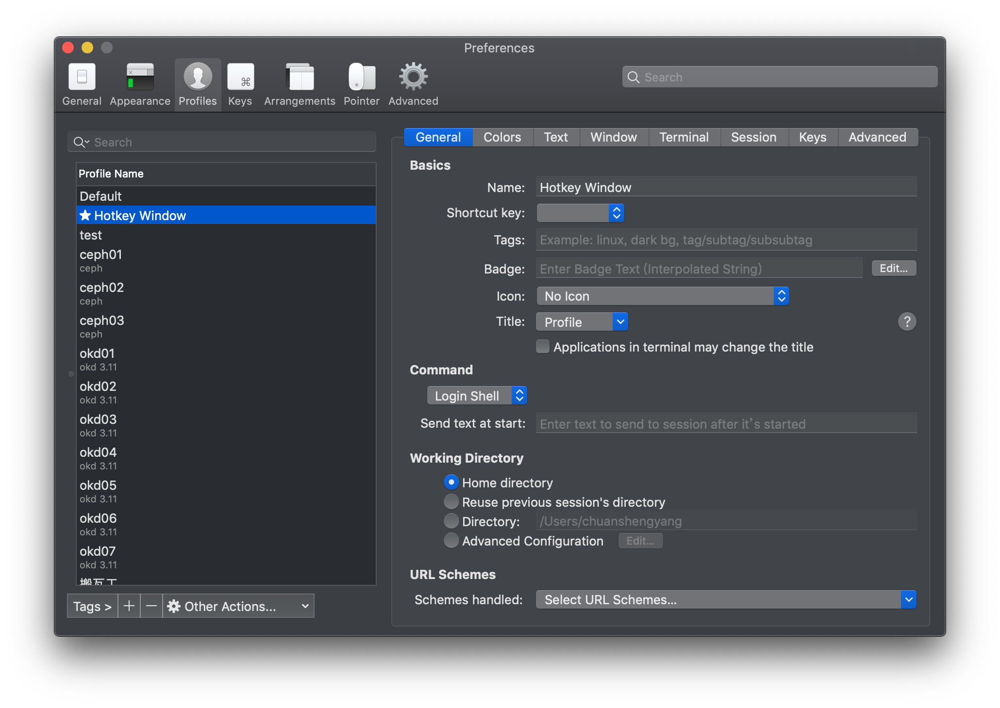

#### 背景透明与模糊设置

在 `Preperence → Profiles → Window → Window Appearance` 进行设置

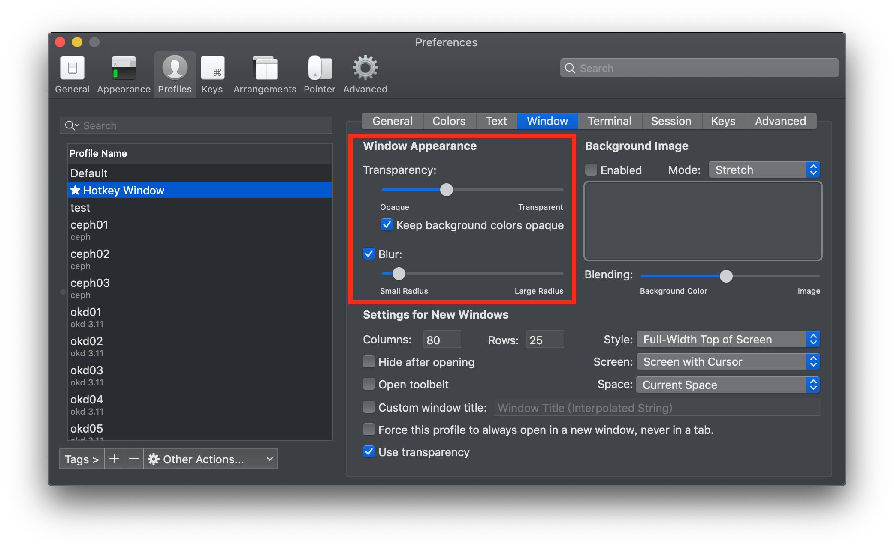

#### 窗口风格配置

在 `Preperence → Profiles → Window → Settings for New Windows` 进行设置

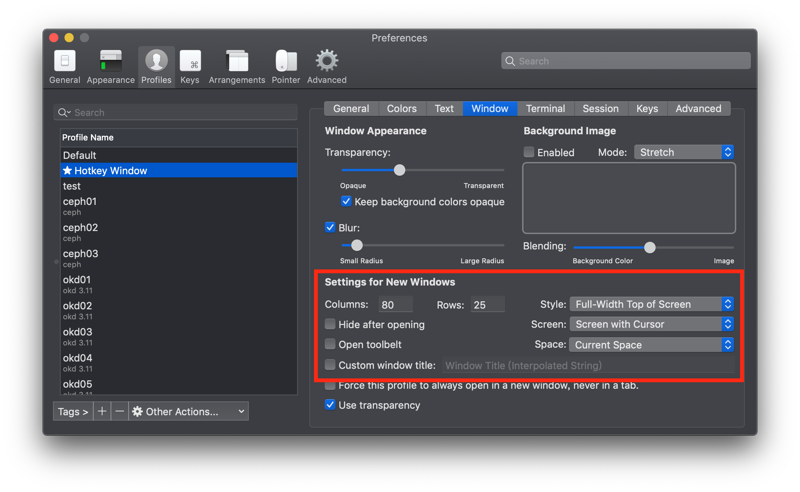

解释一下这几个参数：

- **Full-Width Top of Screen** : 这个很好理解，让终端显示在屏幕顶部，并占满整个宽度。
- **Current Spce** : 表示只显示在当前的工作空间，举个例子吧，假设你在当前屏幕打开了终端，你切换到下一个屏幕时它就不会跟到下一个屏幕。
- **Screen width Cursor** : 这个和上面的参数搭配，用来判定哪个屏幕属于当前的工作空间，表示你的鼠标在哪，哪里就是当前的工作空间。

#### 设置 HotKey

在 `Preperence → Profiles → Keys → HotKey Window` 进行设置

选中 `A hotkey opens a dedicated window with this profile`，表示此 profile 可以通过快捷键快速打开快速关闭。

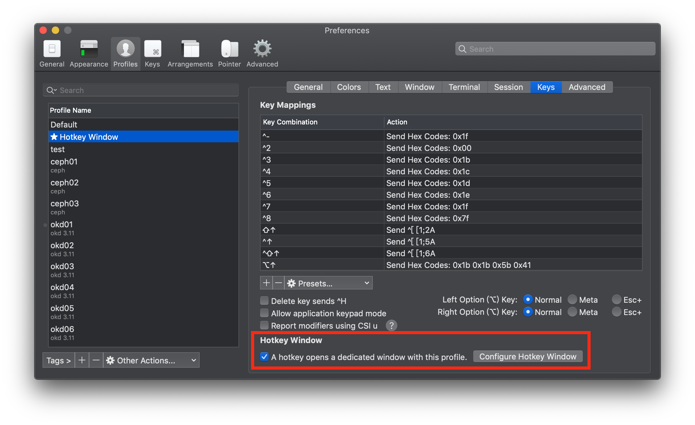

然后点击 `Configure Hotkey Window`，设置快捷键。

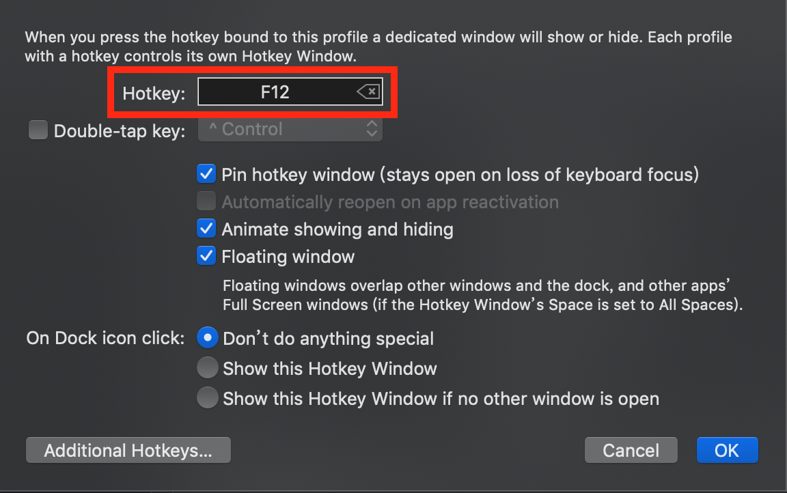

为了只使用一个键，可以使用功能键作为快捷键，我选择的是 `F12`。

对于没有 `Touch Bar` 的 MacBook，我们可以这么设置，首先打开系统偏好设置，选择键盘设置。

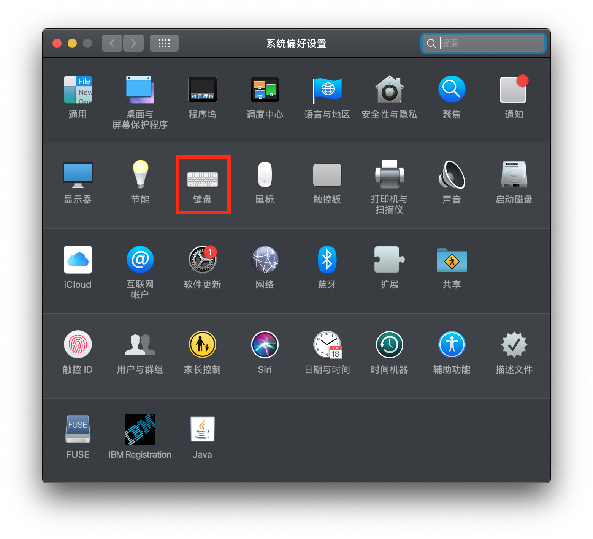

选中 **将 F1、F2 等键用作标准功能键**。

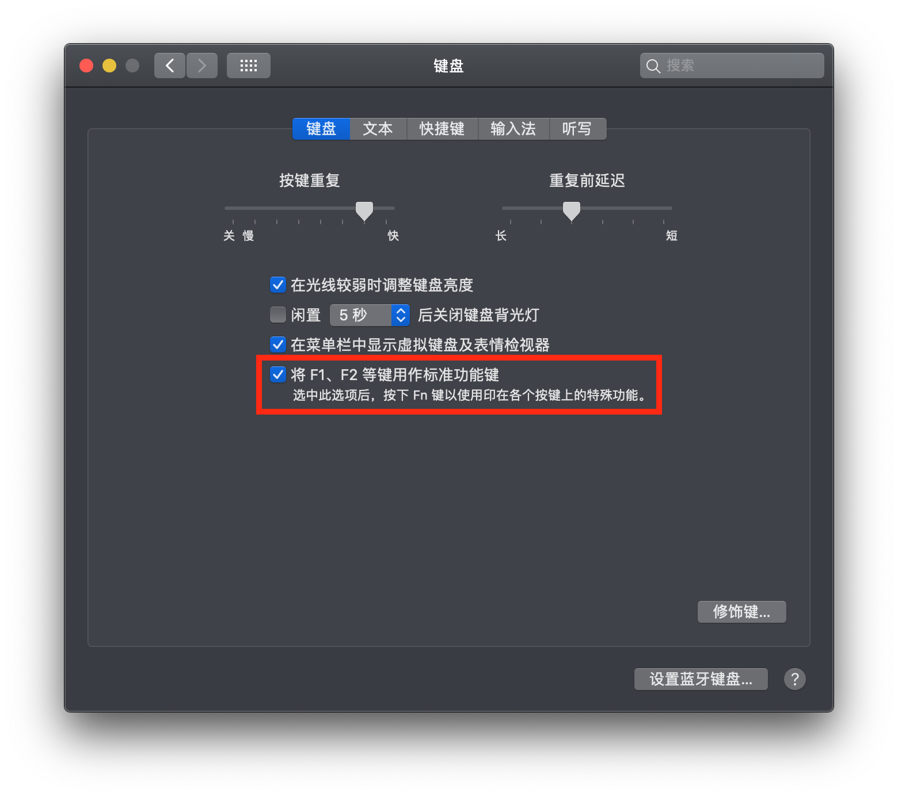

这样你就可以通过 `F12` 来快速打开关闭终端了。

> 请注意：打开了标准功能键之后，以后再想使用功能键的特殊功能，比如 `F11` 减小音量、`F12` 增大音量，必须得和 `Fn` 键组合使用，例如增大音量就是 `Fn+F12`。

对于新款带 `Touch Bar` 的 MacBook，可以这么设置，首先打开系统偏好设置，选择键盘设置。

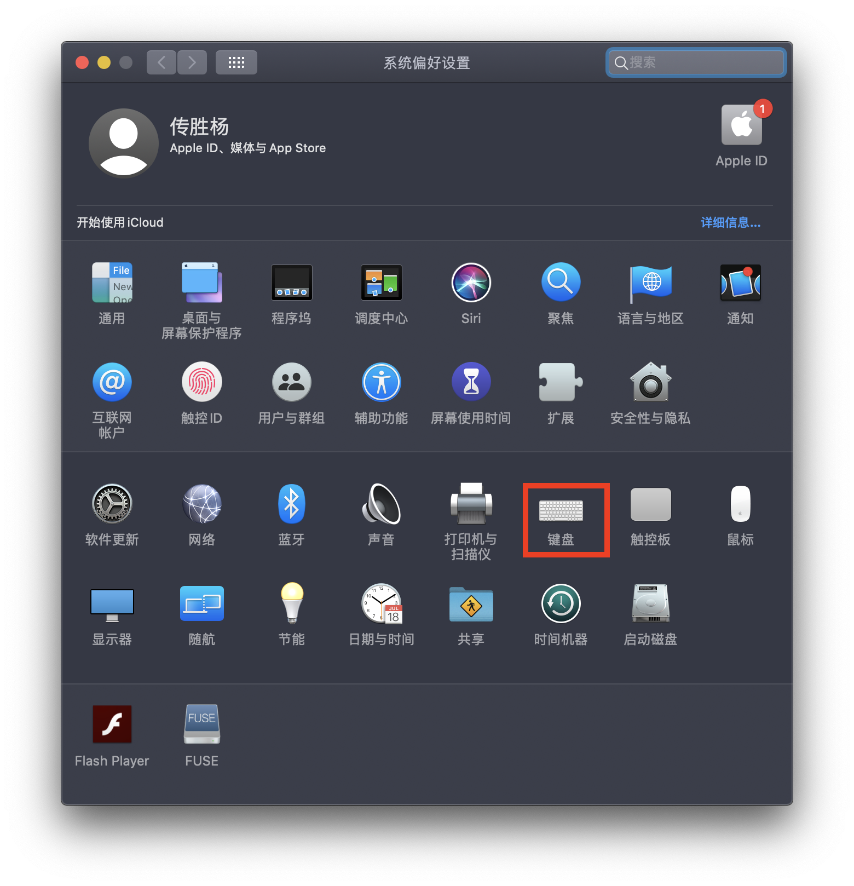

“按下 Fn 键以” 选择 “显示F1、F2等键”：

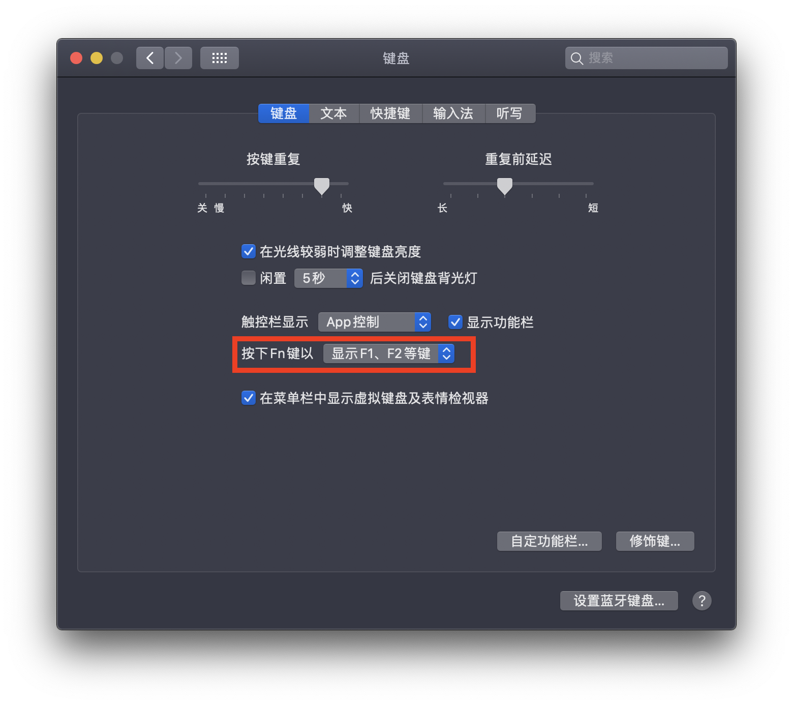

这样就可以使用 `Fn+F12` 来快速打开终端。

同时在 `快捷键 → 功能键` 设置中添加 iTerm 应用，这样打开 iTerm2 窗口时就可以直接使用 `F12` 键来关闭窗口。

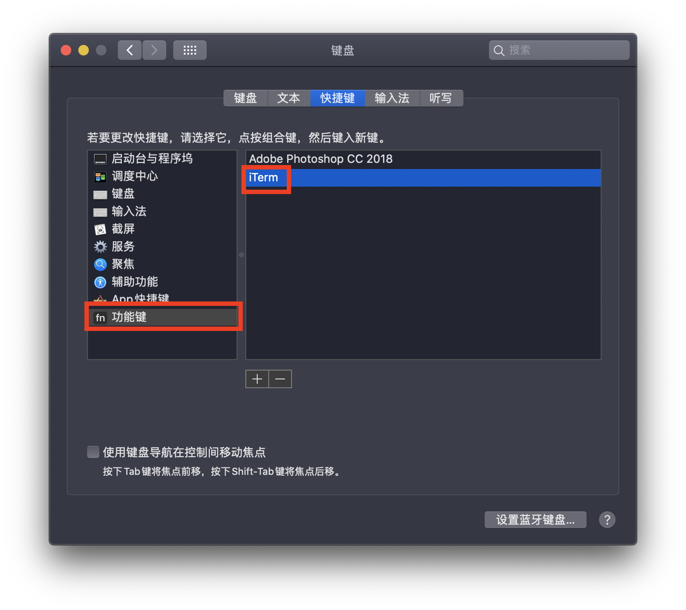

到目前为止，悬浮终端的 `Profile` 就配置完成了，你可以按下你设置的 `HotKey` 来方便快速打开和隐藏命令行。如果你想新建标签页也用这个 Profile，可以将 `Hotkey Window` 设为默认的 Profile：

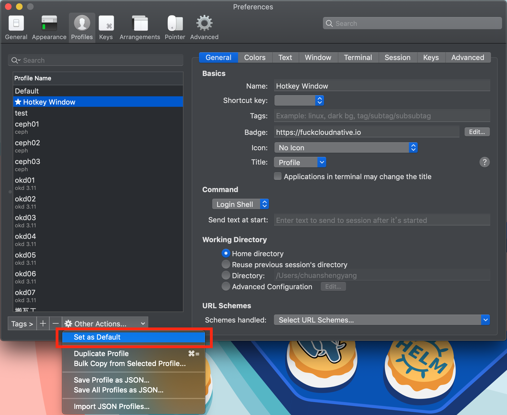

### 关闭启动页面（静默运行程序）

如果你不想每次打开 iTerm2 都打开默认的窗口，也就是静默打开程序，可以在 `Appearence → General` 设置：

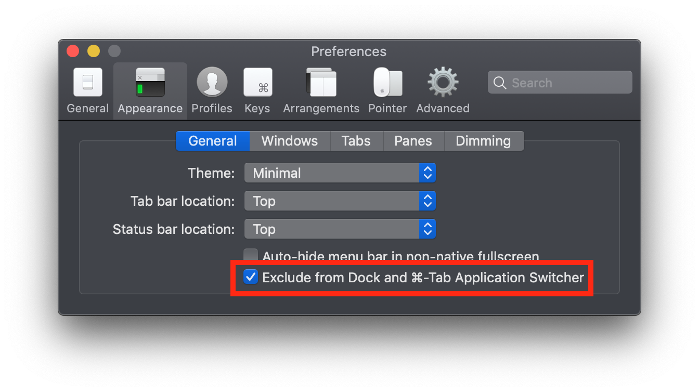

勾选 `Exclude from Dock and ...`，更改设置之后下次你再重新打开 iTerm2 就会变成这个样子：

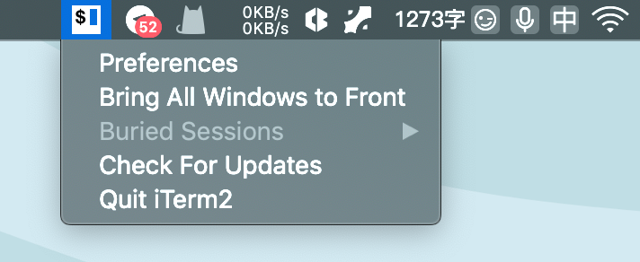

它再也不会出现在 Dock 中，也不会在启动时给你打开一个默认的窗口，你可以优雅地通过快捷键呼入呼出窗口，完美。


## 快捷键

### 光标

| 快捷键             | 自定义 | 作用                            |
| ------------------ | ------ | ------------------------------- |
| ctrl + u           |        | 清楚当前行                      |
| ctrl + f/b         |        | 前进/后退                       |
| ctrl + a/e         |        | 到行首/行末                     |
| ctrl + h/d         |        | 删除光标前一个/当前的字符       |
| ctrl + w/k         |        | 删除光标前面所有/后面所有的字符 |
| ctrl + t           |        | 交换光标处文本                  |
| ctrl + p           |        | 上一条命令                      |
| ctrl + r           |        | 搜索命令历史                    |
| cmd + f            |        | 查找                            |
| ctrl + l / cmd + r |        | 清屏                            |
| cmd + - / + / 0    |        | 调整字体大小                    |

### 分屏

| 快捷键              | 自定义                   | 作用                 |
| ------------------- | ------------------------ | -------------------- |
| cmd + d             |                          | 垂直分屏             |
| cmd + shift + d     |                          | 水平分屏             |
| cmd + w             |                          | 关闭分屏（当前聚焦） |
| cmd + opt + 方向键  | 方向键改为 ; / ' / [ / ] | 切换分屏             |
| ctrl + cmd + 方向键 | 方向键改为 ; / ' / [ / ] | 改变分屏比例         |

### 标签

| 快捷键                   | 自定义               | 作用                   |
| ------------------------ | -------------------- | ---------------------- |
| cmd + t                  |                      | 新建标签               |
| cmd + w                  |                      | 关闭标签               |
| cmd + opt + w            |                      | 关闭所有分屏，关闭标签 |
| cmd + 数字 / 左右方向键  | 左右方向键换成 [ / ] | 切换标签               |
| cmd + shift + 左右方向键 | 左右方向键换成 [ / ] | 移动分屏               |

### 其他

| 快捷键          | 自定义 | 作用           |
| --------------- | ------ | -------------- |
| cmd + enter     |        | 全屏           |
| cmd + ;         |        | 查看历史命令   |
| cmd + shift + h |        | 查看剪贴板历史 |


## 小技巧

1. 复制粘贴
   1. 先`cmd+f`查找选中（可以使用`tab`/`shift+tab快速选中），在iterm2中，选中即复制。
   2. 然后`cmd+shift+h`查看剪切板历史，既可以粘贴。


## *. 参考链接

1. [iTerm2 配置-自定义配置和优化教程（上）](https://icloudnative.io/posts/customize-iterm2-1/)
